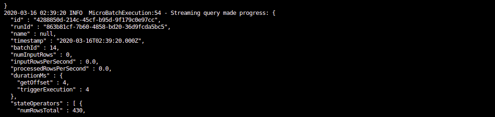
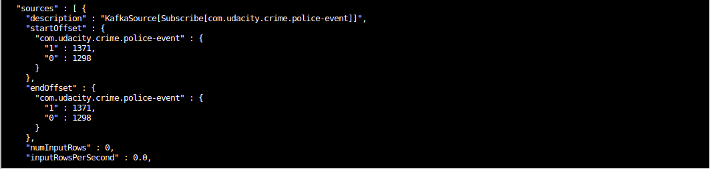

# SF Crime Statistics with Spark Streaming

### Producer

### Consumer

### Spark Streaming

### Questions

How did changing values on the SparkSession property parameters affect the throughput and latency of the data?

- I saw the parameters: inputRowsPerSecond and processedRowsPerSecond value.

What were the 2-3 most efficient SparkSession property key/value pairs? Through testing multiple variations on values, how can you tell these were the most optimal?

- I don't know how to do that.
